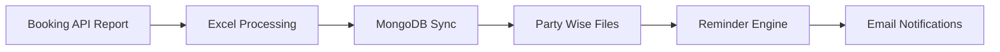

<!-- ===================================================== -->

<!-- ⚡ SENIOR LEVEL GITHUB README -->

<!-- ===================================================== -->

<p align="center">


</p>

---

# ⚡ Open Session Automation Engine (Production Grade)

<p align="center">


</p>

---

## 🧠 What This Project Does

Enterprise-grade automation designed for **Chargezone Open Session Monitoring**.

This system continuously:

* 📥 Downloads booking history reports
* 🔎 Validates live session status from MongoDB
* 📁 Generates Party-wise Excel trackers
* 📧 Sends threaded reminder emails
* ⏰ Runs automatically via Cron (Morning + Evening Cycle)

Built for **production reliability**, not demo automation.

---

## 🚀 Architecture Overview



---

## ⚙️ Core System Features

### ✅ Smart Status Control

* Uses **DB as source of truth**
* Excel only acts as tracker
* Automatically skips:

  * completed
  * cancelled

---

### ✅ Threaded Email Lifecycle

```text
Notification → Reminder 1 → Final Reminder → Thread Closed
```

Emails stay inside one Gmail thread using:

```
inReplyTo
references
```

---

### ✅ Enterprise Cron Workflow

| Time         | Mode    | Behaviour            |
| ------------ | ------- | -------------------- |
| 🌅 08:00 IST | MORNING | Sends Notification   |
| 🌇 17:00 IST | EVENING | Sends Reminder Cycle |

---

## 📁 Project Structure

```
Open-Session-Automation/
│
├── Production-Open_Session.js
├── partyConfig.json
├── DailyReports/
│   ├── YYYY-MM-DD/
│   └── PartyReports/
├── package.json
└── README.md
```

---

## 🛠️ Tech Stack

```
Node.js        → Automation Engine
MongoDB        → Live Session Source
XLSX           → Excel Processing
Axios          → API Client
Nodemailer     → Email Service
AWS EC2        → Deployment
Cron           → Scheduler
```

---

## 🔐 Environment Setup

Create `.env`

```
TOKEN=YOUR_API_TOKEN
MONGO_URI=YOUR_CONNECTION_STRING
EMAIL_USER=yourmail@gmail.com
EMAIL_PASS=app_password
```

Install Dependencies

```
npm install
```

---

## ▶️ Manual Run

### MORNING MODE

```
node Production-Open_Session.js MORNING
```

### EVENING MODE

```
node Production-Open_Session.js EVENING
```

---

## ⏰ Production Cron Setup

```
0 8 * * * node /home/ubuntu/Production-Open_Session.js MORNING
0 17 * * * node /home/ubuntu/Production-Open_Session.js EVENING
```

---

## 🔄 Internal Workflow

```
API Download
     ↓
Excel Parsing
     ↓
MongoDB Validation
     ↓
Party File Creation
     ↓
Reminder Engine
     ↓
Email Dispatch
```

---

## 🧩 Advanced Logic

✔ DB-driven filtering
✔ Duplicate-safe Map merge
✔ Thread persistence
✔ Status revalidation before email
✔ Production-safe logging

---

## 🚀 Deployment (Recommended)

```
pm2 start Production-Open_Session.js --name open-session
pm2 save
pm2 startup
```

---

## 👨‍💻 Maintained By

**Darsh Rajput**
Automation Developer – Chargezone IT

🌐 GitHub: https://github.com/DarshRajput87

---

<p align="center">


</p>

---

## ⭐ If this project helped you

```
Star ⭐
Fork 🍴
Contribute 🚀
```

<!-- ===================================================== -->

<!-- END SENIOR README -->

<!-- ===================================================== -->
